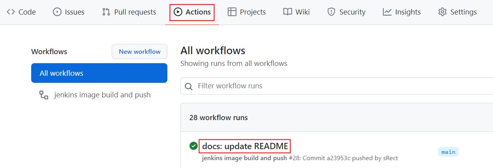

## jenkins 容器安装并部署前端项目

### 1.提前准备

1. 1 台 linux 云服务器或者本地虚拟机代替
2. 在服务器宿主机上装好 docker
3. 准备好 2 个 github 仓库(或者 gitee 仓库),1 个用于 jenkins，1 个用于前端项目(文章以 github 仓库为例)
4. 1 个 dockerhub 仓库，用于存储 jenkins 镜像

### 2.jenkins 容器安装

#### 1. 安装前的疑问

1. 为什么不直接在宿主机上安装 jenkins？
   可以直接在宿主机上安装 jenkins，并不一定非得使用容器这种形式安装，只不过本文使用了容器安装这种方式。

2. 为什么不直接拉取 dockerhub 上的 jenkins 镜像？
   可以直接拉取，但一定要拉取`jenkins/jenkins`这个镜像，`jenkins`这个镜像已经很久没维护了。
   还有官方的 jenkins 镜像默认是没有 sudo 用户权限的，即执行`sudo wget http://xxxx`，是不识别 sudo 命令的，还有常见的`wget`、`vim`、`ping`等常用命令都是没有的，需要自己安装，所以这里选择自己构建 jenkins 镜像。

3. 如何在 jenkins 容器里执行 docker 命令？

   [一番百度，有两种方案](http://www.up4dev.com/2018/11/27/run-docker-by-jenkins-in-docker/)，本文使用了 Docker-outside-of-Docker 方案，另一种未实验成功。

- `Docker-outside-of-Docker`

  使用外部的 docker，即容器宿主机上的 docker。将宿主机的 docker 程序映射到 jenkins 容器里。这样没安装 docker 的 jenkins 容器可以执行 docker 命令。但需要注意的是，容器里本身是没有 docker 的，是把指令发送给宿主机来执行的。

- `Docker-in-Docker`

  顾名思义，在 docker 容器里安装 docker，然后使用 docker。容器里有 docker，和宿主机上的 docker 是隔离的。

#### 2. Dockerfile

```Dockerfile
FROM jenkins/jenkins:latest

USER root
RUN apt-get update \
  # 安装sudo
  && apt-get install -y sudo \
  && rm -rf /var/lib/apt/lists/*
RUN echo "jenkins ALL=NOPASSWD: ALL" >> /etc/sudoers

USER jenkins

EXPOSE 8080
```

#### 3. github 的 workflow 配置文件

- 前提需要在 github 的 jenkins 仓库里设置好 secrets

- 在仓库的`Settings -> Secrets -> Actions`，点击`New repository secret`按钮创建你的 dockerhub 账号和密码，即添加`DOCKERHUB_USERNAME`和`DOCKERHUB_TOKEN`。如下图所示操作：


- /.github/workflows/deploy.yml

```yml
name: jenkins image build and push

on:
  push:
    branches: [main]

jobs:
  build:
    runs-on: ubuntu-latest

    steps:
      - name: Checkout
        uses: actions/checkout@v2

      #制作docker镜像推送到dockerhub
      - name: build and push to dockerhub
        run: |
          docker login -u ${{ secrets.DOCKERHUB_USERNAME }} -p ${{ secrets.DOCKERHUB_TOKEN }}
          docker image build -t my-jenkins:latest .
          docker tag my-jenkins:latest ${{ secrets.DOCKERHUB_USERNAME }}/my-jenkins:latest
          docker push ${{ secrets.DOCKERHUB_USERNAME }}/my-jenkins:latest
          docker logout
```

- git 提交代码

```bash
git add .
git commit -m "feat: init"
git push -u origin main
```

不出意外，`Actions`里可以看到，自动部署成功，镜像也成功推送到 dockerhub 了


